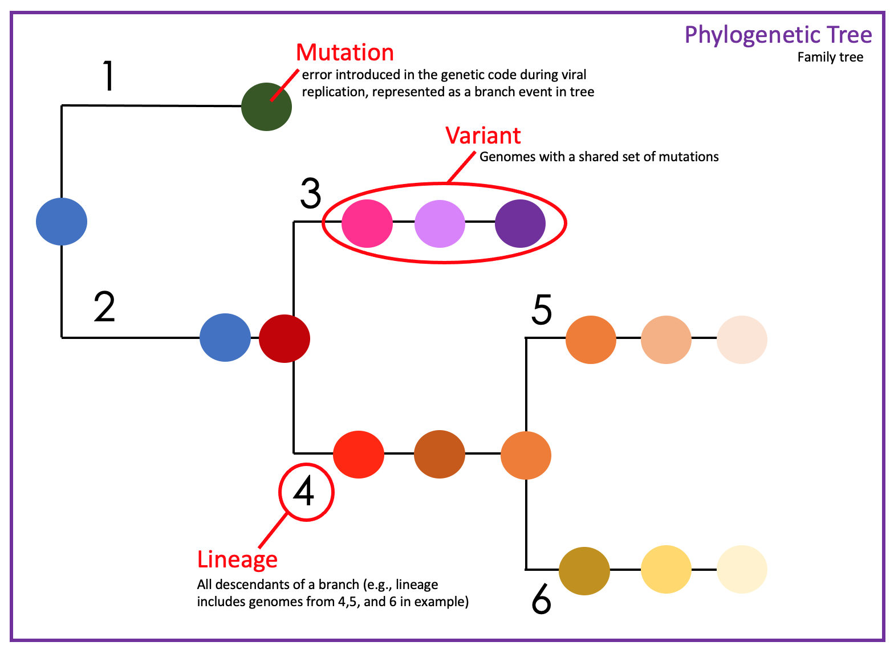

# Glossary of Technical Terms

- **Mutation**: an error introduced in the genetic code during viral replication. Until experimental testing is conducted, we don't know if a mutation will lead to outcomes that are better (e.g., decrease transmissibility), worse (e.g., increase virulence), or have no effect. By sequencing samples we can see if a mutation is caused by a:
    - **substitution**: a mutation when a nucleotide is replaced by another (e.g., G to C). This can either change (*non-synonymous*) the translated amino acid of viral proteins or not (*synonymous).
    - **deletion**: a mutation when one or more nucleotides are removed. This can lead to a *frame-shift* in which all subsequent amino acids are changed.
    - **insertion**: a mutation where one or more nucleotides are added.

- **Variant**: a genome that contains a particular set of mutations
    - **Variant of Concern (VOC)** A variant with a gentic change and evidence for at least one of the following (source:[CDC](https://www.cdc.gov/coronavirus/2019-ncov/variants/variant-info.html)):
        - Evidence of increased transmissibility
        - Evidence of increase in virulence or change in clinical disease presentation
        - Evidence of impact on diagnostics, treatments, or vaccines 

    - **Variant of Interest (VOI)** A variant identified to have genetic changes of interest that are associated with (source:[CDC](https://www.cdc.gov/coronavirus/2019-ncov/variants/variant-info.html)):
        - Specific sets of mutations that are predicted to affect transmission, diagnostics, therapeutics, or immune escape.
        - Evidence that it is the cause of an increased proportion of cases or unique outbreak clusters.
        - Limited prevalence or expansion in the US or in other countries.

- **Lineage**: All descendants on the branch of a phylogentic (*family*) tree. In this dashboard [PANGO](https://cov-lineages.org/) lineages are used to describe SARS-CoV-2 lineages.

- **Strain**: Individual viral genome.

# Variants of Concern in the Context of Alaska
Below you can find information about VOC's and when they were first detected in the state of Alaska.

## Alpha - B.1.1.7
Alpha was first identified in the United Kingdom, also known as: Variant of Concern B.1.1.7, 202012/01, VOC-202012/01, 20B/501Y.V1, 20I/501Y.V1. This variant contains the N501Y mutation and a short deletion in the Spike (S) protein. This variant is concerning because it has shown to be significantly more transmissible (~50%) than the original SARS-CoV-2 lineage. Alpha does not appear to evade vaccine-induced neutralizing antibody responses. Alpha is still circulating in the US.

#### In Alaska: Alpha was detected in December 2020 in the Anchorage/Mat-Su region. Cases have been detected throughout Alaska.

---

## Beta - B.1.351
Beta (also known as: B.1.351, 20H/501Y.V2) was first identified in South Africa and is circulating in the US. The B.1.351 has both N501Y and E484K mutations in the Spike protein. This variant is concerning because it is significantly more transmissible (~50%) than the original SARS-CoV-2 lineages. Preliminary studies suggest Beta, like Gamma, may escape some vaccine-induced and naturally acquired antibody responses. However, as with all VOCs, the Pfizer, Moderna, and Johnson & Johnson/Janssen vaccines remain largely effective against this lineage. 

#### In Alaska: First identified in March 2021 in the Anchorage/Mat-Su region. Cases were detected in the Anchorage/Mat-Su and Southeast regions in May.

---

## Gamma - P.1
Gamma was first identified in Brazil, also known as: Variant of Concern P.1, B.1.1.28.1, 20J/501Y.V3. This variant contains three key mutations in the S gene: E484K, N501Y, and K417T. While preliminary studies suggest the Pfizer, Moderna, and Johnson & Johnson/Janssen vaccines currently deployed in Alaska may have reduced efficacy against Gamma, these vaccines remain largely effective against this lineage and demonstrate protection against serious illness, hospitalizations, and death. Recent analyses suggest that Gamma may be more transmissible with higher risk of severe disease, to some degree.

#### In Alaska: Gamma was identified in early February 2021 in the Anchorage/Mat-Su region. Cases have been detected throughout Alaska.

---

## Delta - B.1.617.2-like
Delta was first identified in India in late 2020, also known as: Variant of Concern B.1.617.2, 20A/S:478K. The Delta variant has become widespread over the last number of months and B.1.617.2 is the predominant lineage in many countries worldwide. In addition to B.1.617.2, Delta also contains lineages AY.1 – AY.25. The AY lineages break up B.1.617.2-like viruses into smaller related clusters that can be tracked separately. These lineages remain classified as the Delta variant and their designation as AY does not imply any functional biological difference from B.1.617.2.

Delta contains key mutations in the S gene: K417N, T478K, L452R, N501Y, P681R, and others of unknown significance. The spectrum of mutations in Delta evades binding of neutralizing antibodies induced by natural infection or vaccines to a measurable extent. This variant has significantly increased transmissibility. It is currently unclear whether Delta is associated with increased severity of infection. According to CDC data, Delta is currently driving case numbers and COVID-19 hospitalizations in the US, particularly among unvaccinated individuals. 

#### In Alaska: Delta was identified in late May 2021 in the Anchorage/Mat-Su region. Cases have now been detected in many additional locations in Alaska. Delta VOC has predominated the surge of cases in July-August 2021 in Alaska. In Alaska, we have the original B.1.617.2 as well as a significant proportion of AY.4. AY.3, AY.10, and AY.12 make up a minority cases. 

---

# Variants of Interest in the Context of Alaska
Below you can find information about VOI's and when they were first detected in the state of Alaska.

## Epsilon - B.1.429 & B.1.427
Epsilon, includes B.1.429 and a related B.1.427 lineages, were first identified in California and known as: CA VUI1. The prevalence of these VOI grew in California from initial observations in summer 2020 and has spread to many other states. Research suggests an increased transmission (~20%). Deescalated from a VOC on June 29, 2021 due to the significant decrease in the proportion of B.1.429 lineage viruses circulating nationally and available data indicating that vaccines and treatments are effective against this variant. This variant is characterized by the L452R mutation in the S gene and is genetically like B.1.351 but lacks several key mutations. 

#### In Alaska: These variants have been detected across Alaska beginning in December 2020. This VOI has not been detected in Alaska since May 2021.

---

## Iota - B.1.526
Iota (also known as B.1.526) was first identified in New York and has begun circulating in other parts of the US. Little is known about this variant, but some genomes contain the E484K mutation in the Spike protein.

#### In Alaska: The B.1.526 variant was identified in February 2021, in the Anchorage-Mat Su region. Cases have been detected throughout Alaska.

---

## Eta - B.1.525
Eta (also known as B.1.525) is circulating in New York and has begun circulating in other parts of the US. Little is known about this variant. The genomes contain the E484K, Q677H, and F888L mutations in the Spike protein.

#### In Alaska: The B.1.525 variant was identified in March 2021, in the Gulf Coast region. This VOI has not been detected recently in Alaska.

---

## Zeta - P.2
Zeta was first identified in Brazil and is also known as: P.2 or B.1.1.28.2. Little is known about this variant beyond that its prevalence grew in Brazil. This variant contains the E484K mutation in the Spike protein but lacks many key mutations in other variants of concern.

#### In Alaska: The P.2 variant was identified in January 2021, in the Southwest Alaska region. This VOI has not been detected recently in Alaska.
